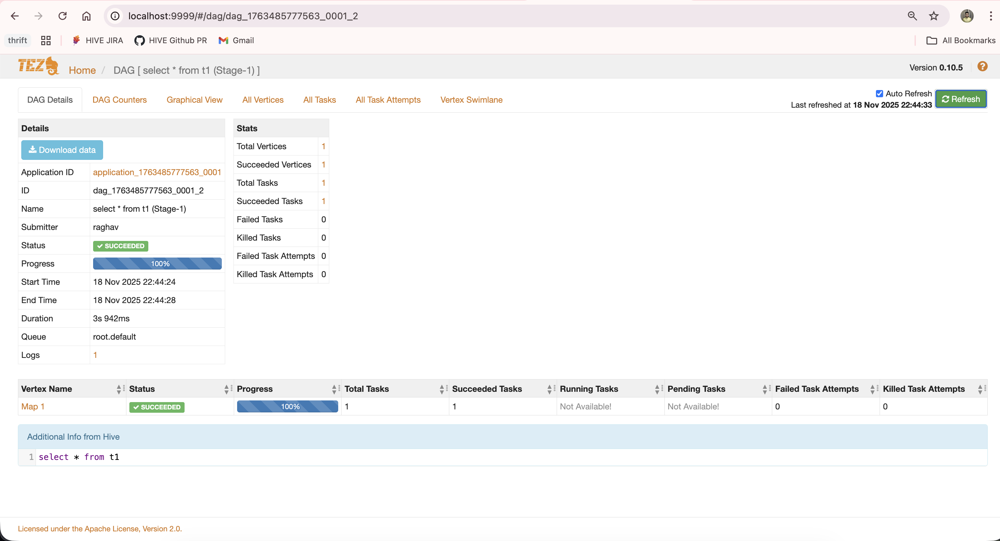

# hive-mac-setup
This project contains the configuration required to setup a single node local hive and trino setup with hadoop and tez

# To enable Tez-view:
1. Use the yarn-site.xml and tez-site.xml from this repo
2. Download tez libraries from [here](https://repository.apache.org/content/repositories/releases/org/apache/tez/tez-ui)
3. `unzip tez-ui-*.war -d tez-ui`
4. Open `tez-ui/config/config.js` and uncomment or set the following lines:
    ```
    timeline: "http://localhost:8188",
    rm: "http://localhost:8088",
    ```
5. Then start tez-view using:
    ```
    cd tez-ui
    python3 -m http.server 9999
    ```
6. Access the UI at http://localhost:9999


